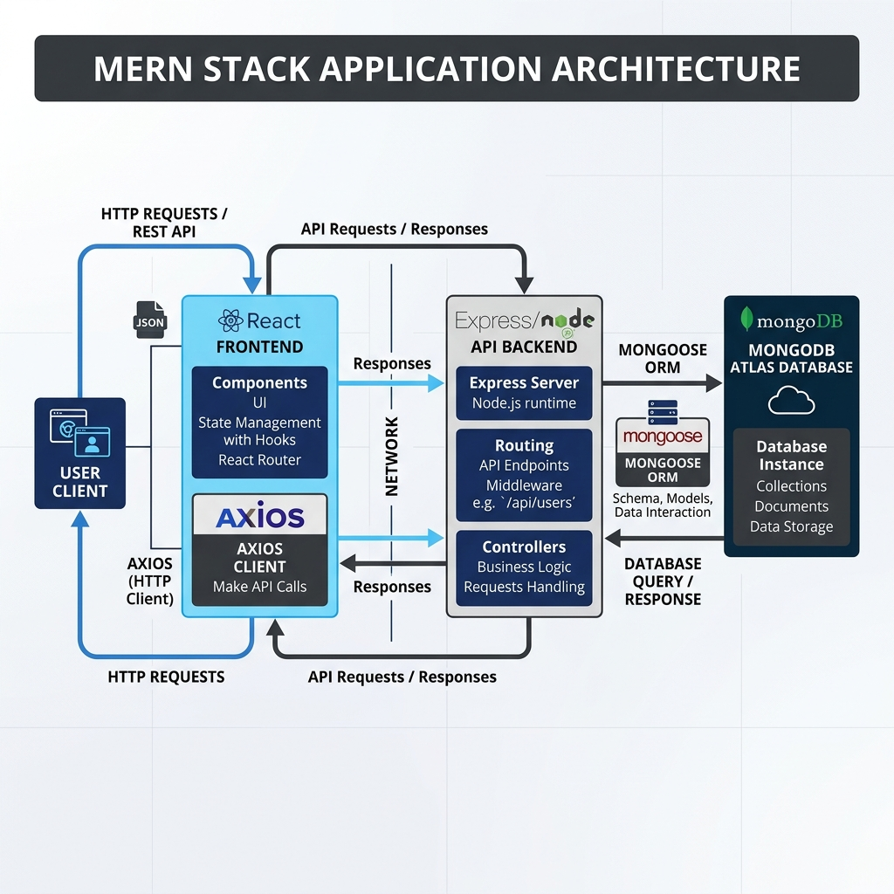
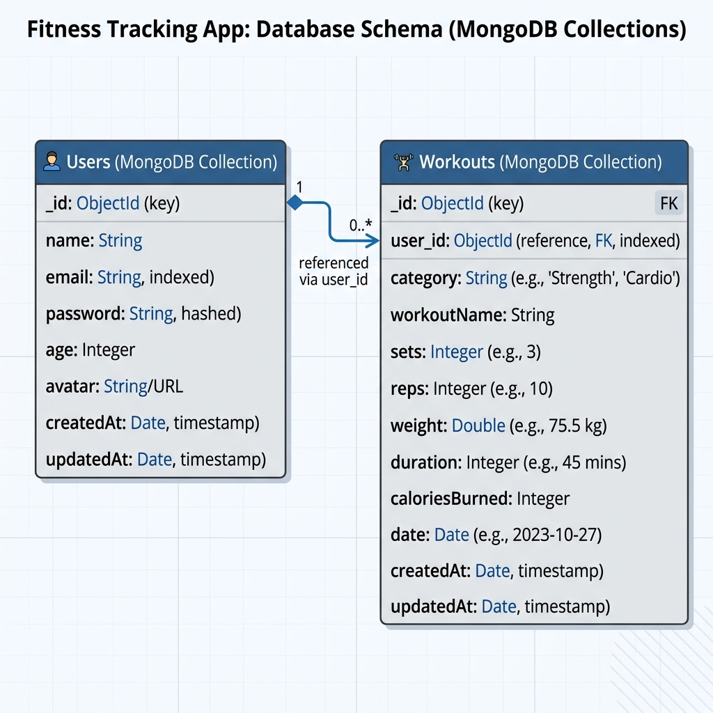
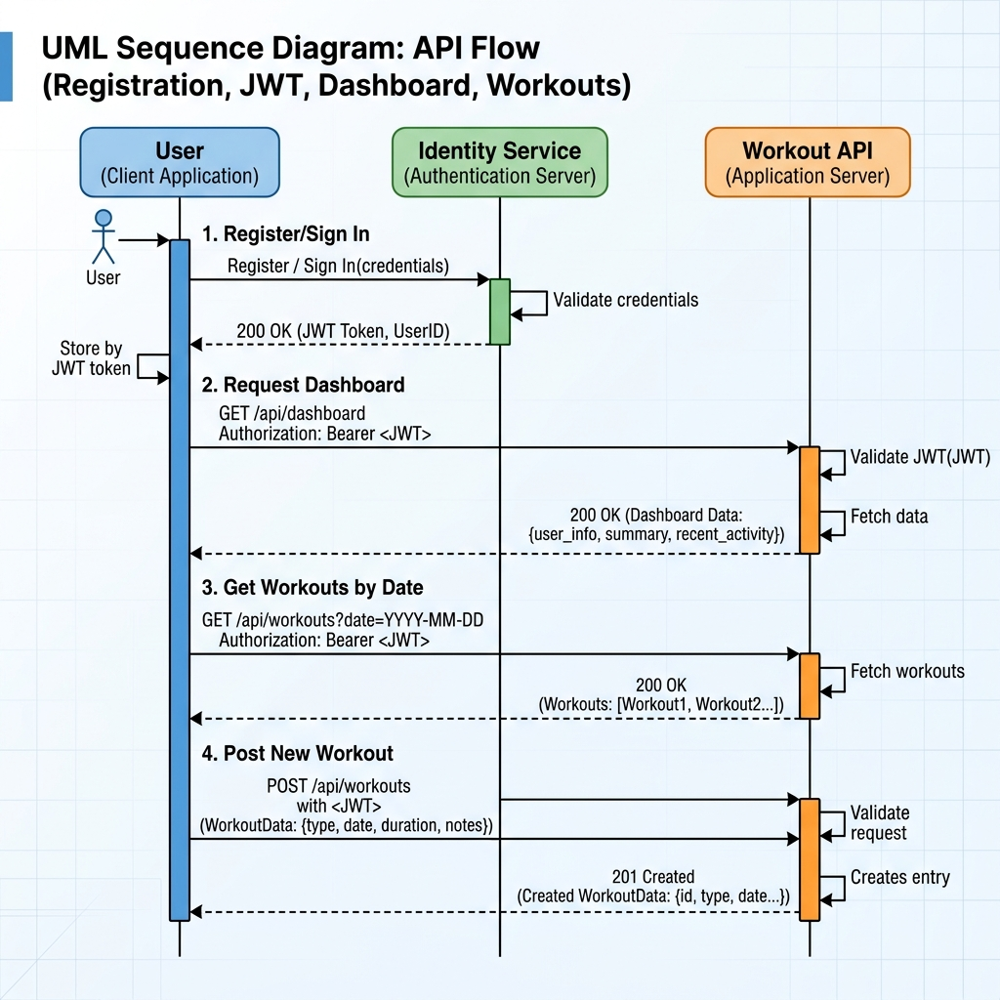

# Fittrack - MERN Stack Fitness Tracker

Fittrack is a full-featured, responsive MERN (MongoDB, Express, React, Node.js) fitness tracking application designed to help users log workouts, view today's summaries, monitor category-wise calorie consumption via interactive charts, and track their performance trend over the last 7 days.

---

## 1. Project Overview
Fittrack simplifies daily workout tracking. Users log in, type a string describing their workouts using simple category hashtags and dashed details (e.g., sets, reps, weight, duration), and the app automatically parses, persists, and displays the statistical metrics.

---

## 2. Live Demo
* **Frontend:** Hosted on Vercel (e.g., `https://fittrack-client.vercel.app`)
* **Backend API:** Hosted on Render (e.g., `https://fitnesstrack-vtv1.onrender.com/api/`)

---

## 3. Features
* **Authentication:** Secure user signup and signin using JWT (JSON Web Tokens) and bcrypt hashing.
* **Dashboard Summary:** Real-time statistics including total daily calories burned, workout count, and average calories burned per workout.
* **Interactive Charts:**
  - Radial Pie Chart for category-wise daily calorie distribution.
  - Bar Chart showing calories burned daily for the last 7 days.
* **Smart Natural Language Parser:** Add multiple workouts in a single text string separated by semicolons.
* **Date-Wise History:** Query historical workouts using an interactive calendar view.
* **Responsive Design:** Optimized layout for desktop, tablet, and mobile screens.

---

## 4. Tech Stack
* **Frontend:** React.js, Redux Toolkit, Redux Persist, styled-components, Axios, Material UI (MUI Charts & Date Calendar).
* **Backend:** Node.js, Express.js, JWT, bcrypt.
* **Database:** MongoDB (via Mongoose ORM).
* **Deployment & CI/CD:** GitHub Actions, Vercel, Render.

---

## 5. Folder Structure
```
FItnessssTraker/
├── .github/
│   └── workflows/
│       └── verify.yml         # GitHub Actions CI workflow
├── docs/
│   ├── screenshots/           # Application screenshots (placeholders)
│   ├── architecture.png       # Block diagram of MERN architecture
│   ├── database-schema.png    # Database Schema UML diagram
│   └── api-flow.png           # API Flow Sequence diagram
├── client/
│   ├── public/                # Public assets and index.html
│   ├── src/
│   │   ├── api/               # Axios instance and API routes
│   │   ├── components/        # Shared components (Navbar, Button, Cards)
│   │   ├── pages/             # Pages (Dashboard, Authentication, Workouts)
│   │   ├── redux/             # Redux Store and Slices (userSlice)
│   │   ├── utils/             # Helper themes, colors, and data structures
│   │   ├── App.js             # Route configurations
│   │   └── index.js           # App bootstrap entry point
│   ├── package.json
│   └── .env.example
├── server/
│   ├── controllers/           # Controller handlers (User & Workouts logic)
│   ├── middleware/            # JWT verification middleware
│   ├── models/                # MongoDB Schema models (User, Workout)
│   ├── routes/                # Express routing endpoints
│   ├── index.js               # Entry point of Node server
│   ├── package.json
│   └── .env.example
└── .gitignore                 # Workspace-wide git ignore rules
```

---

## 6. Architecture Diagram


---

## 7. Database Schema Diagram


---

## 8. API Flow Diagram


---

## 9. Installation Guide

### Prerequisites
* **Node.js** (v18.x or later recommended)
* **npm** (v9.x or later)
* **MongoDB Atlas** account or local MongoDB installation

### Clone Repository
```bash
git clone https://github.com/your-username/fitness-tracker.git
cd fitness-tracker
```

### Install Dependencies
Run in separate terminals, or sequentially:

**For Backend:**
```bash
cd server
npm install
```

**For Frontend:**
```bash
cd ../client
npm install
```

---

## 10. Environment Variables

### Backend Configuration (`server/.env`)
Create a `.env` file inside the `server/` directory:
```env
PORT=8080
MONGODB_URL=your_mongodb_atlas_connection_string
JWT=your_jwt_secret_signing_key
```

### Frontend Configuration (`client/.env`)
Create a `.env` file inside the `client/` directory:
```env
REACT_APP_API_URL=http://localhost:8080/api/
```

---

## 11. MongoDB Atlas Setup
1. Sign up on [MongoDB Atlas](https://www.mongodb.com/cloud/atlas).
2. Create a new cluster and choose a free tier database.
3. Under **Database Access**, create a user with read/write privileges.
4. Under **Network Access**, whitelist `0.0.0.0/30` (allow access from anywhere) or configure your IP address.
5. Get your connection string under **Database > Connect > Drivers** and replace `<password>` and `<username>` in your `MONGODB_URL`.

---

## 12. Local Development Guide

### Running Backend
```bash
cd server
npm start
```
Starts backend server on port `8080` (accessible at `http://localhost:8080`).

### Running Frontend
```bash
cd client
npm start
```
Starts development server on port `3000` (accessible at `http://localhost:3000`).

---

## 13. API Documentation

### Authentication Endpoints
* **POST** `/api/user/signup`
  - Registers a new user.
  - Body: `{ "name": "John", "email": "john@example.com", "password": "securepassword", "img": "optional_avatar_url" }`
* **POST** `/api/user/signin`
  - Logs in user and returns a JWT token.
  - Body: `{ "email": "john@example.com", "password": "securepassword" }`

### Workouts & Dashboard (Protected: requires `Authorization: Bearer <JWT_TOKEN>`)
* **GET** `/api/user/dashboard`
  - Fetches today's total calories burned, total workouts, category breakdown, and last 7 days' statistics.
* **GET** `/api/user/workout`
  - Fetches today's logged workouts. Can query historical dates using query parameters: `/api/user/workout?date=7/1/2026`.
* **POST** `/api/user/workout`
  - Adds one or multiple workouts parsed from text.
  - Body: `{ "workoutString": "#Legs\\n- Back Squat\\n- 5 sets X 15 reps\\n- 30 kg\\n- 10 min" }`

---

## 14. Deployment Guide

### MongoDB Atlas
Deploy Atlas as detailed in [Section 11](#11-mongodb-atlas-setup).

### Render Backend
1. Sign in to [Render](https://render.com).
2. Click **New + > Web Service**.
3. Link your GitHub repository.
4. Set **Root Directory** to `server`.
5. Build Command: `npm install`
6. Start Command: `node index.js` (Note: change start command from nodemon in package.json to node for production).
7. Under **Environment**, add the environment variables:
   - `MONGODB_URL`
   - `JWT`
   - `PORT` (8080)
8. Click **Deploy**.

### Vercel Frontend
1. Sign in to [Vercel](https://vercel.com).
2. Click **Add New > Project**.
3. Import your GitHub repository.
4. Set **Root Directory** to `client`.
5. Under **Framework Preset**, choose **Create React App**.
6. Under **Environment Variables**, add `REACT_APP_API_URL` pointing to your deployed Render URL (e.g., `https://your-backend.onrender.com/api/`).
7. Click **Deploy**.

---

## 15. GitHub Actions
A continuous integration pipeline is configured at `.github/workflows/verify.yml`. It runs automatically on pull requests and pushes to `main`/`master` to build the frontend and test the backend code for syntax validity.

---

## 16. Screenshots Placeholders

### Home / Authentication Screen
*(Add screenshot: `docs/screenshots/home.png` showing Login/Register UI)*

### Dashboard
*(Add screenshot: `docs/screenshots/dashboard.png` showing statistics, circular categories charts, and bar chart)*

### Add Workout Flow
*(Add screenshot: `docs/screenshots/add_workout.png` showing natural language entry text field)*

### Workouts History
*(Add screenshot: `docs/screenshots/history.png` showing calendar and historical cards)*

### Mobile Responsiveness
*(Add screenshot: `docs/screenshots/mobile.png` showing mobile menu toggle and card responsiveness)*

---

## 17. Troubleshooting & FAQ

#### Q: The client won't compile, showing errors about webpack or react-scripts?
**A:** If compiling on Node 18+, set environment flag `NODE_OPTIONS=--openssl-legacy-provider` or update `react-scripts` to `5.0.1` as set in `package.json`.

#### Q: Workout records display NaN calories or fail validation?
**A:** Ensure your workout string precisely matches the formatting template, e.g. starting categories with `#` and prefixing each metric line with `-`. The parsing parser requires proper suffixes: `sets`, `reps`, `kg`, and `min`.

---

## 18. License
Licensed under the ISC License.

---

## 19. Credits
Built with contributions from developers worldwide on GitHub. Powered by React, Node, Express, and MongoDB.
